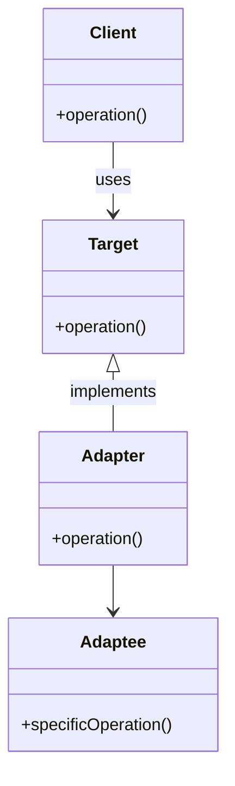

# 어댑터 패턴
> 기존 코드를 클라이언트가 사용하는 인터페이스의 구현체로 바꿔주는 패턴
- 클라이언트가 사용하는 인터페이스를 따르지 않는 기존 코드를 재사용할 수 있게 해준다.

## 장단점
- 장점
  - 기존 코드(Adaptee)를 변경하지 않고 원하는 인터페이스 구현체(Adapter)를 만들어 재사용
    - Open-Closed Principle 준수
  - 기존 코드가 하던 일과 특정 인터페이스 구현체로 변환하는 작업을 각기 다른 클래스로 분리하여 관리
    - Single Responsibility Principle 준수
- 단점
  - 새 클래스가 생겨 복잡도 증가
  - 경우에 따라 기존 코드가 해당 인터페이스를 구현하도록 수정하는 것이 좋은 선택
## 사용처
- 자바
  - Arrays.asList
  - Collections.list
- 스프링
  - HandlerAdapter
    - 우리가 작성하는 다양한 형태의 핸들러 코드를 스프링 MVC가 실행할 수 있는 형태로 변환해주는 어댑터용 인터페이스.
