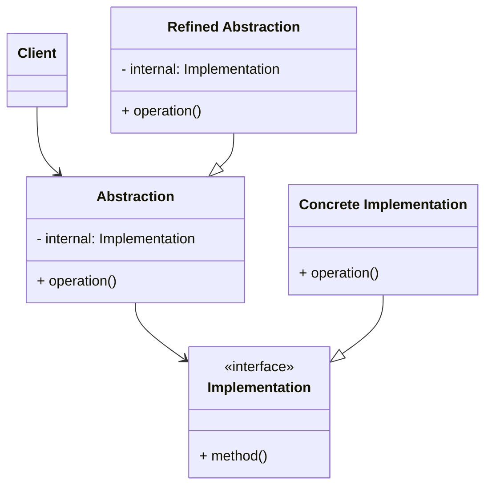

# 브릿지 패턴
> 추상적인 것과 구체적인 것을 분리하여 연결하는 패턴
- 하나의 계층 구조일 때보다 각기 나누었을 때 독립적인 계층 구조로 발전시킬 수 있다.

### 장점
- 추상적인 코드를 구체적인 코드 변경 없이도 독립적으로 확장 가능 -> OCP
- 추상적인 코드와 구체적인 코드를 분리할 수 있다 -> SRP
### 단점
- 계층 구조가 늘어나 복잡도가 증가할 수 있다.
