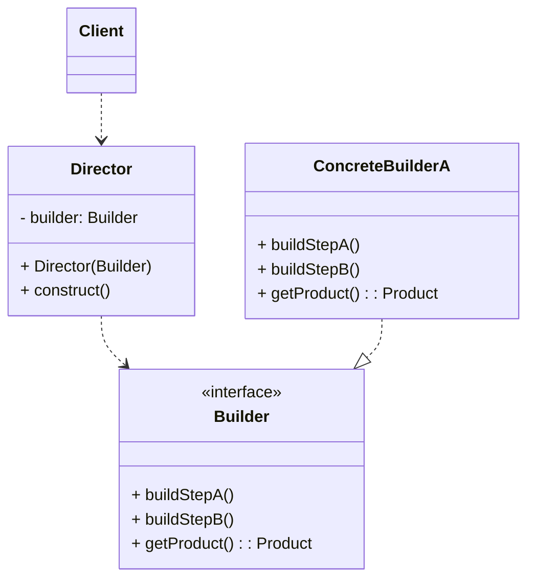

# 빌더 패턴
> 동일한 프로세스를 거쳐 다양한 구성의 인스턴스를 만드는 방법
- 복잡한 객체를 만드는 프로세스를 독립적으로 분리할 수 있다.

- 만들기 복잡한 객체를 단계별로 생성할 수도 있다.
  - 처음에 해야하는 작업이 반환하는 인터페이스와 두번째 작업이 반환하는 인터페이스가 다르게 함.
- 구조가 복잡해질 수 있음.
ex) Stream, StringBuilder
