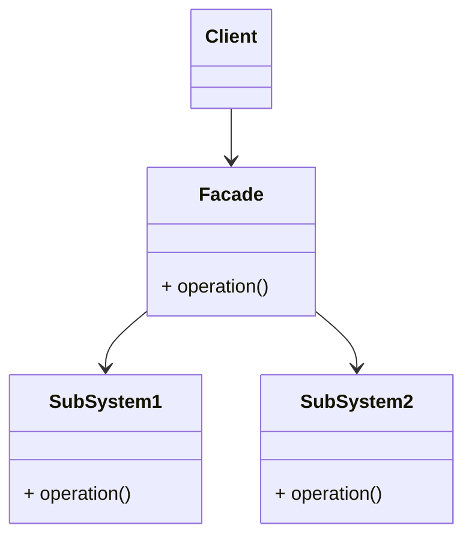

# 퍼사드 (Facade) 패턴
> 복잡한 서브 시스템 의존성을 최소화하는 방법

- 클라이언트가 사용해야 하는 복잡한 서브 시스템 의존성을 간단한 인터페이스로 추상화할 수 있다.

### 장점
- SubSystem에 대한 의존성을 몰 수 있다.

### 단점
- 퍼사드 클래스가 서브 시스템에 대한 모든 의존성을 가지게 된다.

### 적용 사례
- MailSender - JavaMailSenderImpl
- PlatformTransactionManager - JdbcTransactionManager
- 인터페이스 뒤로 숨기고, 각 구현체들은 각 기술에 특화하여 처리
- 특정 기술에 특화되어 있는 것을 뒤로 감춘다.
