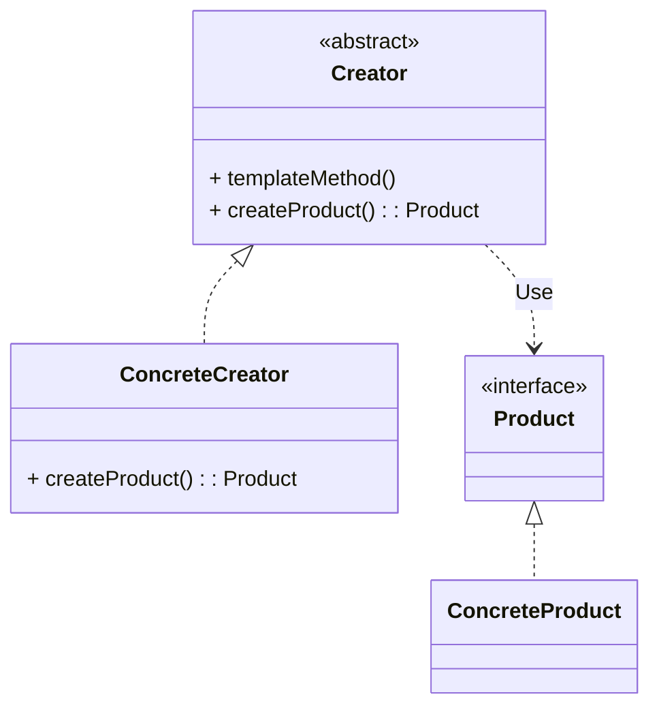
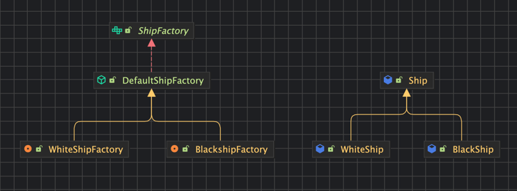

# 팩토리 메서드 패턴
> 구체적으로 어떤 인스턴스를 만들지는 서브 클래스가 정한다.
- 다양한 구현체가 있고, 그 중에서 특정한 구현체를 만들 수 있는 다양한 팩토리를 제공할 수 있다.

## 팩토리 메서드 패턴을 적용했을 때의 장점은? 단점은?
- 확장에 열려있고, 변경에 닫혀있다.
- 새로운 인스턴스를 다른 방법으로 확장하기 쉽다.
- **Product와 Creator간의 관계를 느슨하게 가져갔기 때문이다.**
- 각자의 역할을 나누다보니, 클래스가 늘어나는 단점은 피할 수 없다. 
## OCP(확장에 열려있고, 변경에 닫혀있는 객체 지향 원칙)란 무엇인가?
- 확장에 열려있고, 변경에 닫혀있다 = **기존 코드를 변경하지 않으면서** 새로운 기능을 확장할 수 있는 구조
## 자바 8에 추가된 default 메서드란 무엇일까?
- 인터페이스에 메서드의 기본 구현을 제공할 수 있는 기능
- 기존에는 구현체에서 해당 메서드를 구현하거나, 추상 클래스로 제공해야 했음

##
