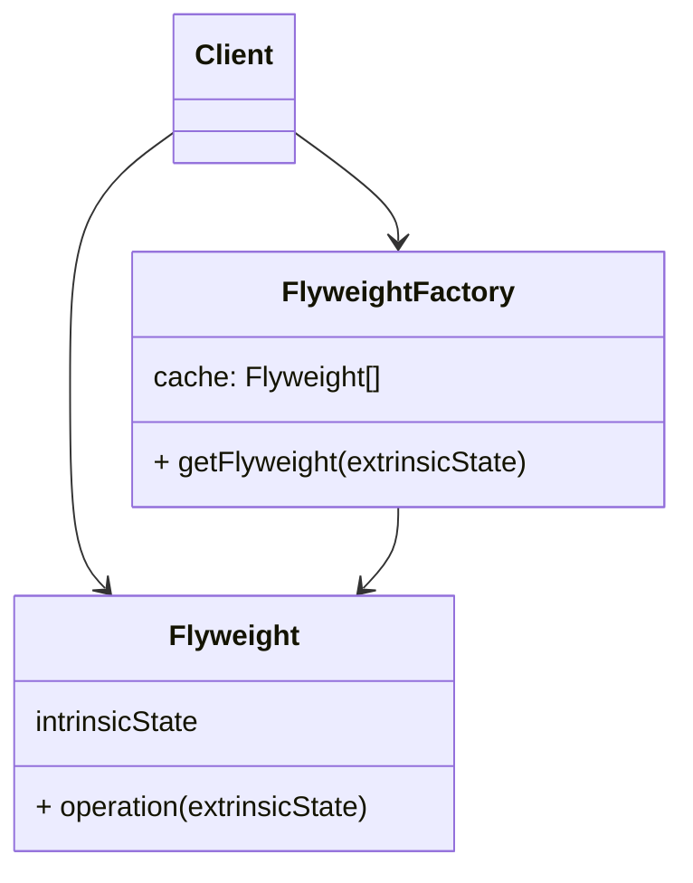

# 플라이웨이트 패턴
> 객체를 가볍게 만들어 메모리 사용을 줄이는 패턴

- 자주 변하는 속성과 변하지 않는 속성을 분리하고 재사용하여 메모리 사용을 줄일 수 있다

```mermaid
classDiagram
    class Client {
    }
    
    class Flyweight {
        intrinsicState
        + operation(extrinsicState)
    }
    
    class FlyweightFactory {
        cache: Flyweight[]
        + getFlyweight(extrinsicState)
    }
    
    Client --> FlyweightFactory
    Client --> Flyweight
    FlyweightFactory --> Flyweight
```

### 장점
- 애플리케이션에서 사용하는 메모리를 줄일 수 있다.

### 단점
- 코드의 복잡도가 증가한다.

### 예시
- Integer.valueOf(int i)
