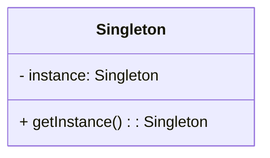

# 싱글톤 패턴
> 인스턴스를 오직 한개만 제공하는 클래스

- 시스템 런타임, 환경 세팅에 대한 정보 등, 인스턴스가 여러 개 일 때 문제가 생길 수 있는 경우가 있다. 인스턴스를 오직 한 개만 만들어 제공하는 클래스가 필요하다.



## 어떻게 쓰이나?
- 자바의 Runtime
- 스프링의 Bean (Singleton Scope)
  - ApplicationContext 내에서 싱글톤
- 다른 디자인 패턴 (빌더, 퍼사드, 추상 팩토리 등) 구현체의 일부로 쓰이기도 한다.

### 스프링 Bean의 싱글톤 구현

스프링은 `synchronized`를 직접 메서드에 거는 대신, `ConcurrentHashMap` 기반의 3단계 캐시 구조로 싱글톤을 구현한다. (`DefaultSingletonBeanRegistry`)

### 3단계 캐시

| 캐시 | 역할 |
|------|------|
| `singletonObjects` | 완전히 초기화된 Bean (1차) |
| `earlySingletonObjects` | 초기화 중인 Bean (2차) |
| `singletonFactories` | Bean 생성 팩토리 (3차) |

2차 캐시에 미완성 Bean을 미리 노출해 순환 참조 문제를 해결한다.

### 동작 흐름

```
getBean("foo")
    ↓
1차 캐시에 있으면 → 락 없이 바로 반환
    ↓ 없으면
synchronized(singletonObjects) 진입
    ↓
Bean 생성 후 1차 캐시에 저장 → 반환
```

Bean 최초 생성 시에만 `synchronized`로 보호하고, 이후 조회는 락 없이 동작하도록 설계되어 있다.
